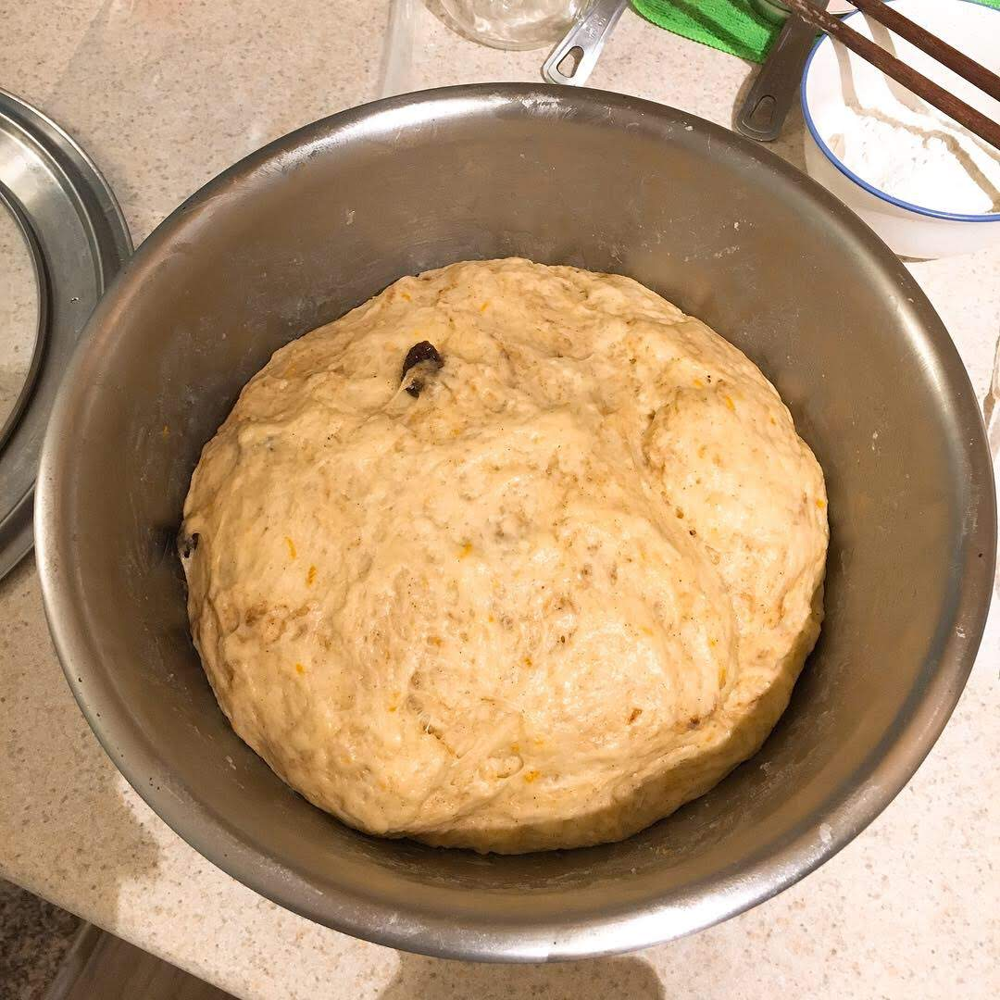

---

title:  "Hot Cross Buns"
source: "Chef John at foodwishes.com"
link: "https://youtu.be/9ZVemIRak2Y"
tags: "bread, bakery, holiday, Western, breakfast"
author: "Athena"
date: "2019-04-21"

---
### Brioche Dough with Holiday Spices

As for the dough, I combined the best part of Chef John's hot bun dough recipe with Alex French Guy Cooking's [Brioche bread dough recipe](https://youtu.be/hY19NK7qBCU) to add some extra buttery flavor to the dough.

1. In a large bowl, mix
```
bread four        500 g
beaten eggs        2
warm milk          200 g (microwave for 30s if from refrigerator)
dry yeast          8 g / 1 packet
```
1. After the dough forms, rest for **15 min**, then add
```
soft butter 100 g/ 1 stick (at room temperature)
sugar        50 g/ 2 tbsp
salt         1 tsp
```
1. Fold in the holiday spices and raisins:
```
orange zest    1 tbsp
nutmeg          1/2 tsp
cinnamon        3/4 tsp
raisin          1/4 cup
```
1. Cover the dough and let it rise for **1.5 hrs** or until double the size in a turned off over or any warm, dry place. Your dough should look like this after this.

1. Divide the dough into 15 equal pieces and form a round ball. My dough weighs about 1000 g, so each small piece should weigh about 67 g. Let the small doughs rise for **15 min** while preparing for the next step.

### Paint the Cross
1. Mix
```
all purpose flour      1/3 cup 
water                  1/4 cup
```
into a thin, pip-able dough.
2. Put the mixture in a sandwich bag and cut one corner. Pipe the mixture on to the doughs and paint the white cross.


### Let's Bake and Glaze!
1. Stack the baking pan on top of another empty baking pan to avoid burning the bottom of the buns. Bake the buns at **400 F** for **20 min**.
2. Prepare the glaze by mixing 
```
white sugar    1/4 cup
water         3 tbsp
```
and heat at medium heat until boiling.
3. Cook the buns for **5 min**, then bush on the glaze.
4. Serve hot and enjoy!