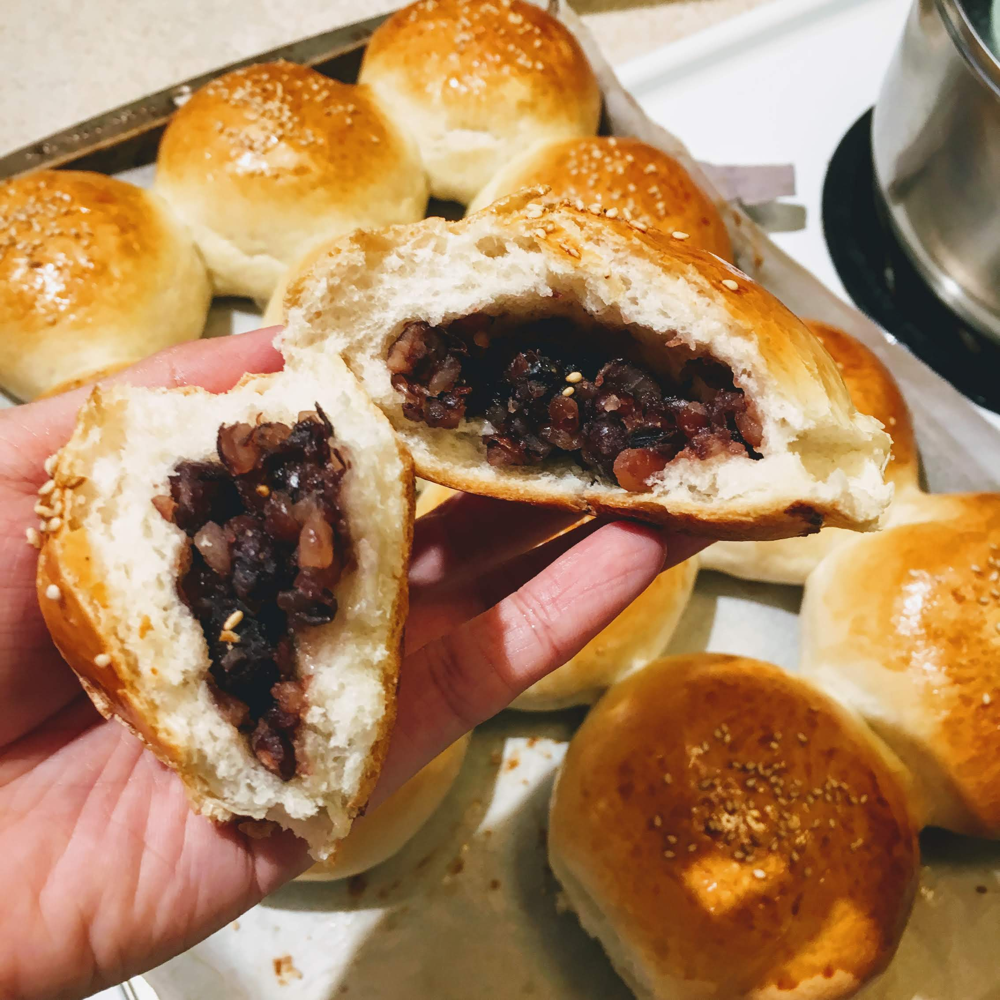

---

title:  "Red Bean Buns 豆沙小圆面包"
source: "小高姐的 Magic Ingredients"
link: "https://youtu.be/5zPqwH8AqXI"
tags: "bread, bakery, Asian, breakfast"
author: "Athena"
date: "2019-03-10"

---
### Red Bean Paste

Adapted from [this recipe from Just One Cookbook](https://www.justonecookbook.com/wprm_print/57654)


1. Put
   ```
   red bean     150 g 
   water        600 ml
   ```
  in Instant Pot. Set to 'Bean/Chili' program and cook for *35 min*. When the cooking is done, stay in the “Keep Warm” mode and let the pressure release naturally. 
3. Mix the beans with `sugar:  120 g`.
4. Saute using the 'Saute - Less' program until the sugar is melted and beans are crushed. Then add `salt: 1 pinch`.

### Bread Bun

The bread buns are adapted from [this video recipe from Gao's Magic Ingredients](https://youtu.be/5zPqwH8AqXI).



1. Combine `Warm water: 260g` and `Dry yeast: 3g (1 tsp)` and wait until the yeast is melted.
2. Add to the yeast water:
```
bread flour   400 g            
sugar         15  g (1 tbsp)   
salt          1   g (1/8 tsp) 
```
Form the dough until there is no dry flour.
3. Rest for *20 min*.
4. Add `unsalted butter: 20 g(1 tbsp)` into the dough. Knead for *8 min* until the dough can form a thin film when stretched.
5. Brush the container with vegetable oil and put the dough in. Rest for *1.5 h*.
6. Knead the dough for *2 min* to squeeze the air out.
7. Divide the dough into 12 buns. Rest for *15 min*.
8. Roll the buns into wraps as large as the palm, and tuck the red bean paste inside. Form them into ball-shaped buns.
9. Brush `egg wash` on the surface of each bun.
10. Rest for *1 h*.
11. Brush the buns with egg wash again. Top them with `sesame seeds`.
12. *375 F/ 190 C*, bake for *20 min*.
